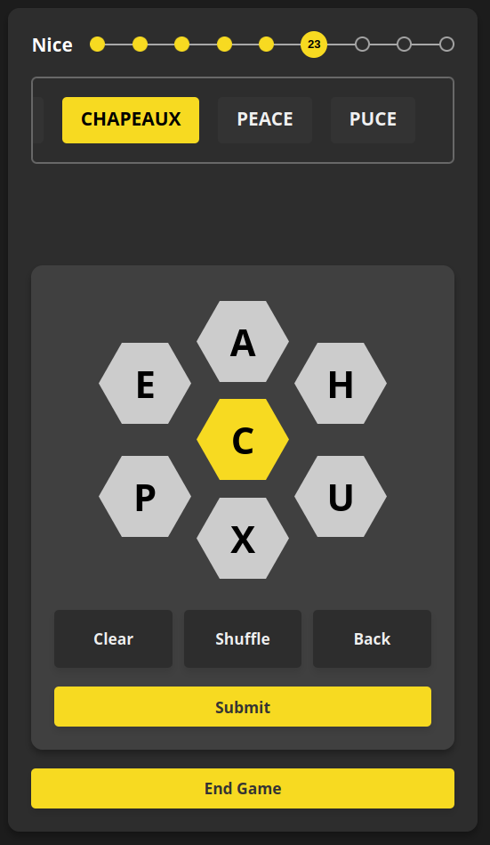

# Shpelling Bee

This is a clone of the NYT game Spelling Bee. Players are presented with a daily word chosen from a vast list. One of the challenges is to identify a pangram which, if found, offers double the points. Here's how the scoring for words breaks down:

- **Beginner**: 0 points
- **Good Start**: 2 points
- **Moving Up**: 5 points
- **Good**: 8 points
- **Solid**: 15 points
- **Nice**: 25 points
- **Great**: 40 points
- **Amazing**: 50 points
- **Genius**: 70 points
- **Queen Bee**: 100 points

## Screenshot

